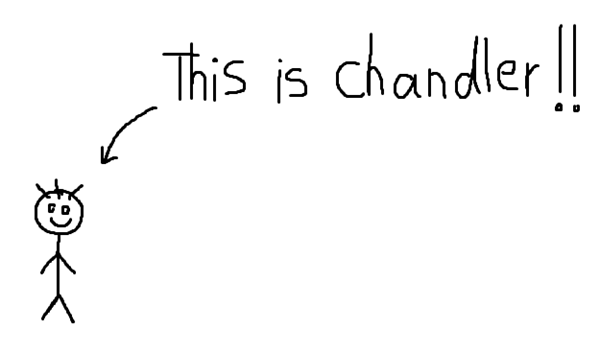
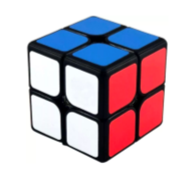
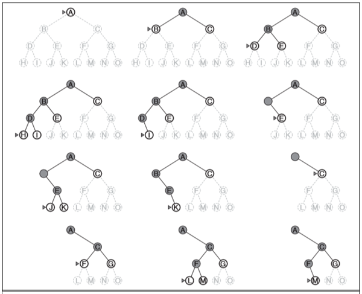
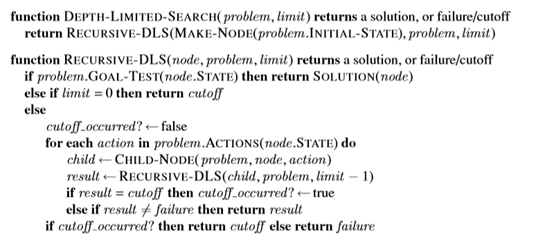
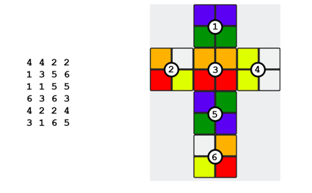

<h1>
In The Name Of ALLAH
</h1>
<h2>
Advanced Programming - Midterm Project
</h2>
<h2>
Dr.Amir Jahanshahi
</h2>
<h3>
Deadline: Friday, 29 Farvardin - 23:00

  
# Introduction

Chandler is a 6th semester university student and have plans to get a job at a gaming company because of family’s financial problem. The company gives a relatively simple task for selecting applicants: Simulating and solving 2x2 Rubik's games!

The game is made up of two parts, Graphics and Algorithms, in which the graphic company demands the use of Qt and C ++ code, and for the Search Algorithm, the DLS algorithm (which is an uninformed search algorithm) in Artificial Intelligence and Algorithms. Note that this project must be done individually (Not in teams). After the deadline, the top 3 projects would be announced!

#  How To Play?
The user, with the help of the graphical environment of the company (which will be made by Chandler as well), begins to specify the color of each part and section of surface, and the program, after execution, announces how to solve the Rubik and writes the directions needed to rotate in each sequence. It should also animate the solution in a beautiful way!

Switching between modes is the same as in the actual game, and you can rotate surface in either round or counter clockwise mode, and you will have a total of 12 modes.

### Attention
Obviously, the user may choose a coloring that is impossible and unreasonable to solve, in this case the program must determine that this problem is insoluble.

#  Algorithm
## Depth-Limited-Search Algorithm (DLS Algorithm)
In AI we have 2 main methods of searching: Informed and Uninformed searching. In Uninformed search we don’t know how far or close are we to the goal, so with checking of reaching to goal or not, we continue our move in all possible directions, but in Informed search we know where our goal is and how far or close we are to the goal, so we define a heuristic which determines which move to choose. 

The DLS search algorithm is one of the uninformed search methods in Artificial Intelligence so that the goal is not clear and we must reach the goal through uninformed moves of the target.

Every state of agent (cube in this example) is called a **node**. Each of these nodes can produce a new node (they are called as parent nodes which produce child nodes) by moving to its next state, so all possible modes are available. These newly made nodes would be a new parent node to new nodes that could be produced by them.

The DLS algorithm determines the depth to extend in various nodes and determines how deep the initial node goes. The final non-goal solution returns to the previous state that it can be check. This algorithm is graphically as follows:

If the desired solution is reached, the algorithm will ignore the rest of the nodes returns the answer.The pseudo-code of this method (DLS) will be as the following.

### Note
DLS will equal Depth-First-Search (DFS) if we set depth to infinity.

#  Graphical Part

Name the surface colors as:

1.  Orange
1.  Green
1.  White
1.  Blue
1.  Red
1.  Yellow

For printing stuff, state the number of the cube and the round and movement.

The initial state of the cube is taken from the input as follows in the order of the number of surfaces mentioned above, the colors of surfaces is shown by numbers as 1 to 6. 
For example, for the following figure, the input would be as follows:

Once you get the answer, your program should display number of expanded nodes and also should display the depth. 0\

## Bonus
Study Bidirectional Search method and solve this question with it (15 extra points)

## Note
For further reading and to resolve questions and doubts, don't miss *Stuart Russel's Artificial Intelligence, A Modern Approach* book chapter 3 (Solving Problems by Searching Chapter).

Qt Graphical part should contain:

1.  Show how to rotate the Rubik to get the desired answer
1.  A reset button for clearing all colored surfaces
1.  A box for writing numbers and colors
1.  Rubik's opened shape to show the initial color of each face as above
1.  The final colored shape of Rubik
1.  Rubik's shape in each step by the choice of user
1.  Displaying the requested information above such as depth

Your GUI must also be implemented in the way that it has a box contatining the colors mentioned above, click on each part of Rubik to paint Rubik.This method can be used instead of the numbering method mentioned above by the selection of user.

The more beautiful and exciting your output and GUI, the better your grade!

##  HELP Chandler get the job to have a pleasant life 
